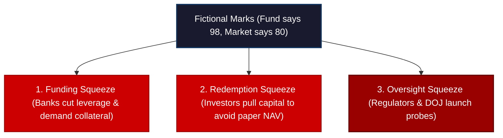

# BlackRock Probe: Private Credit Valuation Squeeze

The U.S. Department of Justice (DOJ) is actively investigating the valuation techniques and asset marks inside a private credit trust managed by BlackRock. This regulatory escalation should make every single participant in the financial markets stop and pay attention. 


<!-- truncate -->

This does not mean BlackRock—the largest asset manager in the world, with over $10 trillion in assets under management—is going to disappear. It does not even prove that a criminal offense has occurred. No wrongdoing has been established, and the investigation is still in its early stages. 

Rather, this probe exposes the exact structural fault line that critics of the private credit bubble have warned about for years: **the opacity and potential manipulation of private credit valuations.** 

We are moving past the early cracks of this cycle. The private credit bubble has officially transitioned into **Stage 2**, where trust in reported marks collapses, and the illusion of low-volatility private assets meets the cold reality of a global collateral and funding squeeze.

---

## The Illusion of "Mark-to-Legend"

The private credit boom was built on a simple, seductive promise: *investors do not need to worry about daily market volatility.* 

Unlike public equities or liquid corporate bonds, private loans are not traded every second on public exchanges. There is no active, continuous market discovery. Proponents of the asset class argue that this is a feature, not a bug. They tell pension funds and insurance companies that because these loans are held to maturity, they are shielded from the irrational panics of public markets.

But there is a dark side to this low-volatility illusion. If there is no active market price, the fund manager must model the loan's value internally. Critics have long derided this process as **"Mark-to-Legend"** or **"Mark-to-Model."** 

```
   Valuation Mechanisms compared:
   ┌────────────────────────────────────────────────────────┐
   │ Public Markets (Mark-to-Market):                       │
   │ Market Price = Immediate, unbiased, liquid discovery  │
   ├────────────────────────────────────────────────────────┤
   │ Private Credit (Mark-to-Legend):                       │
   │ Internal Model = Assumptions, comparables, cash flow   │
   └────────────────────────────────────────────────────────┘
```

During the expansionary phase of the credit cycle, this works beautifully. Loans are marked near par (100 cents on the dollar), Net Asset Values (NAVs) look rock-solid, and managers collect handsome fees based on those steady valuations. 

But when the underlying corporate borrowers begin to stress under the weight of higher rates and a slowing economy, these models become the entire game. If the model insists a loan is worth 98 cents, the fund's NAV remains high. But if the public market would only pay 80 cents for that same risk, the model is no longer reflecting reality—it is simply delaying the inevitable.

---

## The Three Crises of Fictional Valuations

When the gap between reported models (98 cents) and implied market value (80 cents) becomes too wide, the private credit fund is hit by three distinct transmission mechanisms of distress:



1. **The Funding Crisis:** Private credit funds rely heavily on leverage from major commercial banks to boost their returns. If lending banks begin to believe the true value of the underlying loan portfolio is 80, while the fund insists it is 98, the banks will adjust their collateral parameters. They will demand higher haircuts, reduce leverage, or call for margin payments, instantly squeezing the fund's liquidity.
2. **The Redemption Crisis:** If pension funds and institutional investors suspect that a fund’s reported NAV is artificially inflated, they will rush to redeem their capital before the inevitable write-downs occur. When redemptions spike, the fund is forced to either gate withdrawals (trapping investor cash) or sell off its best assets to meet liquidity demands.
3. **The Regulatory Crisis:** When law enforcement and regulators—such as the DOJ and SEC—begin to ask whether valuation techniques are actively misleading investors, the game changes entirely. The threat of legal action forces managers to become more conservative, leading to sudden, sharp asset write-downs.

---

## Not an "Isolated Incident": The Mega-Manager Signals

For the past year, private credit defenders have tried to explain away every point of friction as a minor, isolated case. A single bad loan was a "one-off." A Business Development Company (BDC) trading at a steep discount was just a case of "fickle retail investors." 

But when you look at the actions of the industry's absolute giants, the "isolated incident" defense completely collapses:

| Manager | Vehicle / Asset Class | Current Signal & Stress Marker |
| :--- | :--- | :--- |
| **BlackRock** | Private Credit Trust | Active DOJ investigation into valuation models and asset marks. |
| **Blue Owl** | Public & Private BDCs | Executing a massive **$85 million stock buyback** to support stock prices trading at deep discounts to NAV; facing an investor lawsuit alleging inflated valuations. |
| **Carlyle** | Carlyle Secured Lending (CSL) | Aggressively **slashed its dividend** despite management's public claims of an "improving credit environment." |
| **KKR / Apollo** | Troubled Specialty Funds | Actively restructuring distressed portfolios and dealing with rising problematic corporate debt under the surface. |

Let's look at the Carlyle and Blue Owl signals specifically. 

Carlyle’s BDC dividend cut is a classic lagging indicator of income pressure. BDCs are income-generating shells; their entire appeal to investors is their yield. Management would never cut a dividend unless they were forced to preserve capital due to deteriorating asset performance and shrinking net interest margins. 

Meanwhile, Blue Owl BDCs are buying back $85 million of their own shares. While buybacks are always spun as "signs of confidence," they are actually a defensive mechanism to fight market skepticism. If public investors fully trusted Blue Owl’s reported NAV, the shares would trade at par. The fact that Blue Owl must burn cash to support its share price proves that the public market does not believe the marks.

---

:::info **Eurodollar University Membership**
If you are serious about your financial education and want clarity in a world of confusion and economic narratives, the **Eurodollar University Membership** is designed for you. We bridge the massive gaps left by mainstream education on fundamental monetary mechanics. 

Unlock a comprehensive library of:
* **Foundational & Advanced Lectures** on the global offshore money system.
* **In-Depth Case Studies** and real-world shadow banking analyses.
* **Weekly Q&A Sessions** and updates on global macro and central bank policy.
* **Derivative Signal Guides** to read critical market indicators found nowhere else.

Take control of your financial perspective. **[Join Eurodollar University today](https://www.eurodollar.university/memberships)** to understand how money actually works.
:::

---

## The 7 Signals of Stage 2 Squeeze

As we descend deeper into Stage 2 of this credit cycle, here are the seven key indicators that will dictate the speed and severity of the private credit unwind:

1. **BDC Discounts to NAV:** Watch the spread between BDC share prices and their reported NAVs. If these discounts continue to widen, it represents an explicit public vote of no confidence in the managers' internal models.
2. **Further Dividend Cuts:** Slashing distributions is the ultimate proof that cash flows from underlying borrowers are drying up.
3. **Non-Accruals & PIK Surges:** Track the percentage of loans designated as non-accrual and the rise of Payment-in-Kind (PIK) structures. When companies pay interest with *more debt* instead of cash, it is a ticking time bomb.
4. **Widespread NAV Markdowns:** Look for a broad, downward trend in reported portfolio values across major private funds.
5. **Bank Haircut Adjustments:** If commercial banks begin tightening terms on leverage facilities backed by private loans, the funding squeeze will accelerate.
6. **Insurance Company Deleveraging:** Insurance firms have been the largest institutional buyers of private debt. If regulators force them to re-evaluate their risk parameters, a massive source of capital will instantly vanish.
7. **Regulatory Contagion:** Watch if the DOJ's probe into BlackRock expands into a broader, industry-wide investigation of private credit valuation practices.

## Conclusion: The Transition to Reality

The private credit boom was built entirely on trust: trust in corporate cash flows, trust in underwriting models, and trust in the reliability of reported valuations. 

But a credit cycle does not require a sudden "Lehman Brothers" moment to cause severe economic damage. Often, the damage occurs slowly, through the steady erosion of confidence. When investors stop believing the marks, banks stop accepting the collateral, and managers stop renewing the credit. 

The DOJ investigation into BlackRock is not an isolated regulatory headache. It is the definitive marker that the private credit sector is moving from the "trust me" phase to the "show me" phase. As Stage 2 deepens, the fiction of stable private valuations will continue to dissolve, and the real cost of this shadow bubble will finally be exposed to the real economy.

---
*This analysis is part of our Global Macro series, focusing on credit markets, shadow banking plumbing, and systemic corporate debt cycles.*
