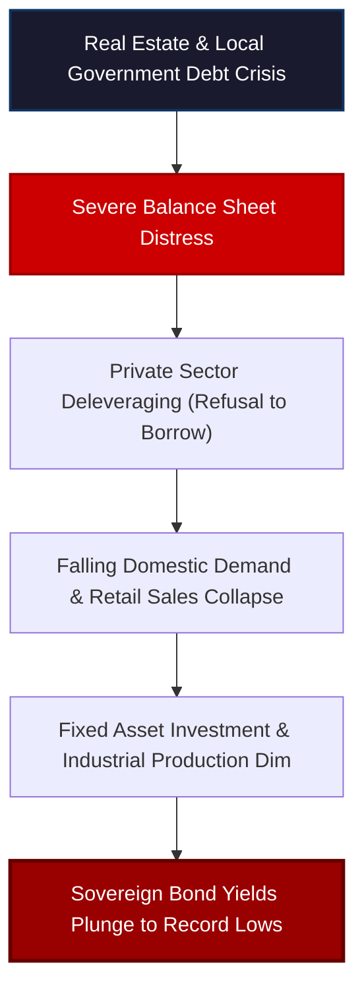

# China's April Data Collapse: Fictional Recovery Ends

The economic contraction in China has taken another devastating blow, leaving mainstream financial commentators and central bank technocrats thoroughly bewildered. 


<!-- truncate -->

This is not a temporary, cyclical dip. It is the bad kind of economic contraction—the kind that validates every warning we have seen in credit markets, shadow banking, property collateral, and plunging sovereign bond yields. 

The latest macroeconomic data release for April is ugly in every single direction. Retail sales have plummeted to their worst levels since the lockdowns. Fixed asset investment, which magically stabilized earlier in the year, is collapsing once again. Industrial production—previously the sole shining light of the Chinese economy—is suddenly dimming. And home prices have fallen for the twelfth consecutive month.

This widespread collapse raises some highly uncomfortable questions, starting with: *what exactly happened to the statistical revisions we saw just a few months ago?*

---

## The NPC Revisions: Political Illusion vs. Real Economy

To understand the severity of April’s data collapse, we must go back to the Chinese retail sales report for March. 

Just ahead of the National People’s Congress (NPC), the National Bureau of Statistics (NBS) suddenly revised previous estimates. In a highly suspicious statistical maneuver, they erased what had looked like a sharp, accelerating contraction in consumer spending, replacing it with a flat, stable trajectory. 

The timing was immaculate. These revisions appeared exactly when the senior leadership of the Chinese Communist Party (CCP) was gathering in Beijing to project global confidence, defend their ambitious 5% growth targets, and lay out the next Five-Year Plan.

```
   Retail Sales Revisions:
   ┌────────────────────────────────────────────────────────┐
   │ pre-NPC March Revisions:                               │
   │ Data altered to erase the sharp contraction trend     │
   ├────────────────────────────────────────────────────────┤
   │ post-NPC April Reality:                                 │
   │ Revisions reversed; retail sales collapse to cycle low │
   └────────────────────────────────────────────────────────┘
```

But political decrees cannot print real consumer demand. Once the political theater of the NPC concluded, the structural weakness returned with a vengeance. The NBS was forced to quietly reverse those revisions, and the new April figures have driven consumer spending off a cliff. 

Chinese households are not behaving like consumers in a recovering economy. They are hoarding cash, deleveraging, and acting as though the worst is yet to come.

---

:::tip **A Word from Our Sponsor**
Most of what we cover at Eurodollar University concerns the mechanics of the global financial ledger, balance sheet capacity, and central bank failures. But a question I receive constantly is: *"What do I do with this information?"* 

While everyone's personal situation is different, it is important to understand that most retirement accounts are built around a very narrow set of assets. Physical gold held in a gold IRA is one alternative option that many are unaware of. 

We are proud to partner with **Augusta Precious Metals**. Like us, their approach is **education-first**. They will walk you through exactly how a gold IRA works—the mechanics, fees, and custodian setup—letting you decide if it is a fit for your wealth preservation strategy.

To learn more and receive a free comprehensive guide, visit **[augustapreciousmetals.com](https://www.augustapreciousmetals.com)** or text **EURO to 35052**.

*Disclosure: Augusta Precious Metals is a paid sponsor. This content is for educational purposes only and does not constitute investment advice. Consult a qualified financial professional before making any investment decisions.*
:::

---

## The Housing Collapse and the Household Balance Sheet

Despite a continuous stream of historical property bailouts, mortgage easing, bank relief programs, and local government "bazookas," China’s real estate sector remains in a persistent state of decay.

The NBS 70-city home price index fell by another **0.2% month-on-month in April**. This represents:
* **12 consecutive months** of outright price declines.
* Price drops in **31 of the past 35 months**.
* An aggregate decline of **more than 11%** in average home prices over the past three years.

```
  China Housing Price Index (NBS 70-City Average):
  ┌──────────────────────────────────────────────────────────┐
  │ Month-on-Month Change in April    : -0.2%                │
  │ Continuous Monthly Declines       : 12 Months            │
  │ Months in Decline (Past 35 Months): 31 Months            │
  │ Total 3-Year Value Loss           : > 11%                │
  └──────────────────────────────────────────────────────────┘
```

In China, real estate represents the primary store of household wealth and the ultimate collateral for the credit system. Unlike the US, where wealth is heavily distributed into equities and retirement accounts, Chinese families have parked the vast majority of their savings in property. 

When property values fall month after month, the "wealth effect" is completely erased. Stressed families respond by slashing discretionary spending, freezing debt expansion, and aggressively paying down existing mortgages. This was verified in the recent banking data, which showed household loans contracting by a record margin in April. 

---

## The Failure of Fixed Asset Investment

For decades, China's growth model relied on a simple formula: when consumer demand is weak, the state pumps capital into infrastructure and manufacturing capacity through **Fixed Asset Investment (FAI)**.

In late 2025, FAI was collapsing. Then, just before the NPC, FAI magically spiked. But like the retail sales revisions, this political bounce was short-lived. In April, FAI collapsed once again, returning to its long-term downward trajectory.



This investment collapse is critical because FAI is China’s secondary engine. If private businesses are too risk-averse to invest, and highly indebted local governments are physically unable to fund new projects, the state-directed investment engine stalls. 

This leaves the economy entirely dependent on **exports and industrial production**. But in April, even industrial production disappointed mainstream expectations. The global economy cannot absorb China's industrial overcapacity forever, especially as trade tensions rise and tariffs loom in the US and Europe.

---

## The Bond Market: Plunging Yields as Information

Mainstream economists continue to repeat the same tired mantra: *Beijing simply needs to provide "more stimulus."* They believe that further interest rate cuts and reserve requirement ratio (RRR) reductions will magically revive credit expansion.

But they are confusing symptoms with cures. Plunging yields are not a sign of effective monetary policy; they are a warning of economic depression.

The Chinese government bond market did not buy the NPC "bazooka" narrative. Yields have plummeted to historic lows, and the curve has bull-steepened, driven by short-term rates returning to the extreme lows of late 2024.

This market pricing represents a massive flight to safety and liquidity:
1. **Zero Loan Demand:** Private borrowers refuse to take on debt, regardless of how low rates fall, because they see no profitable opportunities.
2. **Extreme Bank Risk Aversion:** Commercial banks, burdened by rising non-performing loans (NPLs) in real estate and squeezed net interest margins, refuse to take on private risk. Instead, they hoard ultra-safe sovereign bonds, driving yields to the floor.
3. **Extend and Pretend:** Banks are stuck rolling over bad debts, delaying defaults, and adjusting terms to maintain the appearance of stability, while the real economy suffocates.

---

## Conclusion: A Global Warning

The economic slowdown in China is not a minor domestic friction. Because China is the ultimate driver of global trade, industrial commodities, and manufacturing supply, a balance sheet contraction in Beijing has massive global ramifications:

* **Sustained Export Dumping:** With domestic demand dead, China will continue to dump its excess industrial capacity globally, accelerating trade conflicts with the US and Europe.
* **Commodity Squeezes:** The global commodity complex will face significant downward pressure as Chinese industrial demand dries up, as seen in the recent collapse of copper prices.
* **Global Deflationary Pulse:** Stressed Chinese manufacturers will compete aggressively in foreign markets through lower prices, exporting their domestic deflationary crisis to the rest of the world.

The April data has finally caught up to the structural warnings of the credit and bond markets. The fictional recovery has officially ended, and the global economy now faces a deeply fragile Chinese engine trapped in a systemic balance sheet recession.

---
*This analysis is part of our Global Macro series, focusing on credit markets, shadow banking plumbing, and systemic corporate debt cycles.*

---
_Monitor global market regimes and institutional credit flows in real-time with [Dashboard Options](https://dashboardoptions.com/)._
