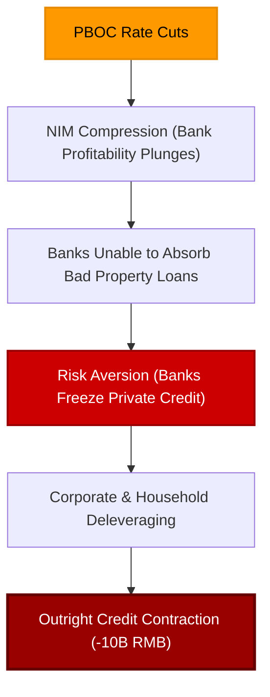

# China Sends Huge Warning: Inside the Credit Collapse

Mainstream financial markets are highly excited about the upcoming summit between Donald Trump and Xi Jinping. The media is framing the meeting as a potential turning point for global trade, hoping that a simple handshake can erase years of tariff wars, supply chain disruptions, and deteriorating relations. 


<!-- truncate -->

Yet, while the press focuses on the political theater in Washington, China’s internal credit and banking data tells a completely different story. The real narrative is not the summit itself, but **why Beijing is so desperate to hold it**. 

China’s domestic credit engine is collapsing. Total Social Financing (TSF) has plummeted, bank loans are actively contracting, and household debt has suffered the largest decline in modern history. The summit is not a sign of geopolitical strength—it is a desperate attempt by Beijing to buy time as its domestic economy slides deeper into a balance sheet recession.

## The Brutal Reality of April's Credit Data

In China, the real economy is completely inseparable from the banking system. The Chinese growth model has been built entirely on bank-directed credit, property collateral, and state-backed investment. When China's lending figures freeze, the entire economic transmission mechanism stops.

The latest credit release from the People’s Bank of China (PBOC) contains three catastrophically weak figures:
1. **Total Social Financing (TSF) Collapse:** TSF—the broadest measure of credit including bank loans, corporate bonds, and shadow banking—fell to a dismal **620 billion yuan**. This represents barely half of last April's total. 
2. **Outright RMB Loan Contraction:** New RMB bank loans suffered a rare, outright **contraction of 10 billion yuan**. Mainstream economists had predicted an *increase* of 300 billion yuan.
3. **Record Household Deleveraging:** Household loans (the primary indicator of mortgage demand and consumer confidence) **collapsed by over three-quarters of a trillion yuan (750 billion yuan)**. This is the largest drop since records began in 2010.

```
  China April Credit Data vs. Expectations:
  ┌──────────────────────────────────────────────────────────┐
  │ TSF (Total Social Financing)      : 620B Yuan (50% drop) │
  │ New RMB Loans (Expected: +300B)   : -10B Yuan (Decline)  │
  │ Household Loans (Mortgages/Credit): -750B Yuan (Record)   │
  └──────────────────────────────────────────────────────────┘
```

A negative household loan print of 750 billion yuan means that Chinese families are actively paying down their existing mortgages and credit card balances faster than they are taking on new debt. This is not a recovery—this is a **systemic balance sheet contraction**.

## The Balance Sheet Recession Trap

Western commentators constantly insist that China simply needs to inject more monetary "stimulus." They assume that if the PBOC cuts interest rates and orders banks to lend, credit will automatically flow back into the system.

This assumes both that banks want to lend and that borrowers want to borrow. Currently, neither is true.



On the borrowing side, private companies and households are refusing to take on debt:
* **The Property Collapse:** Chinese property prices have been falling for years. Major developers have defaulted, and pre-sold apartments remain unfinished. 
* **The Wealth Effect Erased:** For decades, real estate represented the primary store of wealth and collateral for Chinese families. With the property bubble popped, the household balance sheet has been shattered. 
* **Discretionary Spending Freezes:** Stressed families are hoarding cash for emergency savings rather than buying consumer goods.

On the lending side, China's commercial banks are trapped:
* **Net Interest Margin (NIM) Compression:** The PBOC’s interest rate cuts are actually squeezing bank profitability.
* **Bad Debt Squeeze:** Lower margins make it incredibly difficult for banks to generate the profits needed to absorb the colossal volume of non-performing loans (NPLs) sitting on their books—linked to bankrupt developers, local government financing vehicles (LGFVs), and state-owned enterprises (SOEs).
* **Extreme Risk Aversion:** Fearing insolvencies, commercial banks are refusing to take on private sector risk, choosing instead to park their capital in safe, liquid government bonds.

This is the exact same **"balance sheet recession"** trap that paralyzed Japan in the 1990s. Rates go down, but credit continues to contract.

## Why Beijing Desperately Needs the Summit

With its domestic economic engine broken, China has only one remaining engine to absorb its massive industrial capacity: **Exports**. 

Because Chinese consumers are refusing to spend, Chinese factories are generating an immense volume of excess industrial goods. To keep the economy from collapsing, Beijing must dump this overcapacity onto the rest of the world.

This makes the export sector and the external trade balance the absolute lifeblood of China's survival in 2026. 

If Donald Trump imposes new, massive tariffs, or if European nations launch an aggressive trade war, China's last remaining pressure valve will blow. The Chinese economy cannot absorb its own industrial output. A major trade shock today would turn their slow-burning banking crisis into an immediate systemic crash.

This is the reality of the Trump-Xi summit. Xi Jinping is not meeting Donald Trump from a position of economic strength. He is meeting him because **he desperately needs to negotiate a trade truce** to buy breathing room for his export manufacturers.

## Conclusion: Watch the Banks, Not the Handshakes

A successful summit can easily change the media narrative. A warm handshake and a vague statement about "continuing trade dialogue" will spark a brief rally in global stock markets. 

But a political truce cannot force a Chinese family to buy a mortgage. It cannot make a bankrupt real estate developer solvent. And it cannot restore the profit margins of a risk-averse commercial bank. 

The structural credit collapse within China is a permanent, systemic reality. While the media focuses on the political theater of the Trump-Xi summit, the real trajectory of the global economy is being written in the balance sheets of China's commercial banks. In the Eurodollar world, credit fundamentals always override political theater.

---
*This analysis is part of our Global Macro series, focusing on credit markets, shadow banking plumbing, and systemic corporate debt cycles.*

---
_Monitor global market regimes and institutional credit flows in real-time with [Dashboard Options](https://dashboardoptions.com/)._
