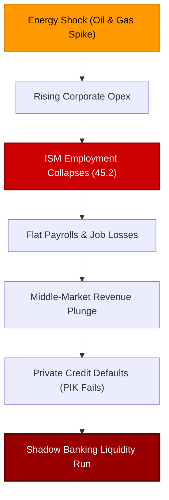

# Dimon's Warning: Private Credit 'Probably Not' Systemic

Jamie Dimon, Chairman and CEO of JPMorgan Chase—the largest bank in the United States and the largest in the world outside China—has released his highly anticipated annual letter to shareholders. The document is typical of the Wall Street giant: filled with extensive charts, detailed graphs, and thousands of words highlighting the bank’s record-breaking successes. Yet, amid the self-congratulatory prose, a single, heavily hedged word stood out like a sore thumb: **"Probably."**

<!-- truncate -->

Specifically, when addressing the growing concerns surrounding the shadow banking sector and private credit, Dimon wrote that in the grand scheme of things, private credit is **"probably not a systemic risk."** 

This single hedge—*probably not*—speaks volumes. If the private credit markets were as resilient as mainstream analysts claim, the head of the world's most powerful financial institution would confidently state there is no systemic threat. Instead, Dimon is hedging his bets. 

It is the exact same cautious hedge Warren Buffett, the Oracle of Omaha, made recently when questioned about the same shadow credit bubble: *"I don't think I know if there is systemic risk or not."* When Wall Street's most formidable leaders refuse to rule out a systemic crisis, it is time to look closely at the plumbing.

## The Rotten Underwriting of Private Credit

Dimon's letter did not just stop at his systemic hedge; he went on to confirm almost every warning we have published regarding the deteriorating standards of private credit underwriting. He noted that when a true credit cycle turns, losses across leverage lending in general will be **"higher than expected."**

He explicitly pointed to several systemic weaknesses:
* **Decaying credit standards:** Credit underwriting has weakened modestly across nearly every sector.
* **Aggressive "add-backs":** Valuation models are built on highly optimistic, fictitious assumptions about future earnings rather than realized cash flows.
* **Gutted covenants:** Lenders have stripped away protective covenants, leaving them with no recourse as borrowers deteriorate.
* **Exploding PIK usage:** Spiking reliance on Payment-in-Kind (PIK) loans is being used to paper over immediate defaults (as highlighted in our [recent analysis of Fitch's defaults data](/blog/oracle-layoffs-credit-cycle-turns)).
* **Regulatory arbitrage:** Shadow lenders are using aggressive, private credit ratings to bypass bank-like oversight and hoard high-yield, high-risk assets.

Crucially, Dimon emphasized the **complete lack of transparency** and **absence of rigid mark-to-market pricing** in private credit. Because these private loans are valued based on internal spreadsheets rather than active market bids, they appear stable. 

But this stability is a dangerous illusion. If the economic environment continues to worsen, the lack of transparent pricing will cause investors to panic and sell indiscriminately at the first sign of trouble, converting an illiquid market into a frozen one.

## It All Leads Back to Flat Payrolls

As we have argued since last summer, the ultimate catalyst for the private credit bust is not the math on a spreadsheet—it is the **US labor market**. 

In macroeconomics, corporate defaults are intimately tied to employment. We call this the **"Flat Payrolls"** dynamic. When the economy stops generating job growth, it is a double-edged sword:
1. **Consumers suffer:** Reduced income leads to lower consumer spending, dry liquidities, and rising defaults on credit cards and auto loans.
2. **Employers break:** Flat or contracting payrolls are a reflection of stressed employers. Middle-market enterprises—the very companies that borrowed heavily from private credit funds at variable rates—are struggling to survive. Long before they lay off their first worker, they were already failing to cover their debt service requirements.

Once payrolls flatten or decline, corporate defaults do not just rise; they cascade.

## The Energy Shock Hits the Service Sector

The data is now confirming these structural fractures. The recent, dramatic spike in crude oil, diesel, and gasoline prices—driven by geopolitical escalation in Iran—has delivered a devastating blow to the US economy. 

This energy shock is slamming into a pre-existing labor slowdown. The evidence is undeniable:
* **The Services Contraction:** S&P Global recently announced the first overall contraction in the service sector PMI in three years, noting that its employment sub-index had slipped back into contraction territory.
* **The ISM Employment Collapse:** The non-manufacturing ISM survey for March painted an even grimmer picture. While the headline prices index jumped to 70 due to rising energy costs, the **Employment Index collapsed by nearly 7 points to a dismal 45.2**. 

Historically, sharp spikes in energy costs act as a massive tax on both consumers and businesses. Stressed corporate employers respond the only way they can: by freezing hiring, cutting hours, and laying off staff.

## The Tokyo Carry Trade: Vindicated After Two Years

The current panic is the natural continuation of a warning that originated in Tokyo. Two years ago, in the summer of 2024, Japanese carry traders triggered a massive global market ripple. 

While the Federal Reserve was still claiming that inflation was "sticky" and that rate cuts were far off, traders in Tokyo connected two basic points: **US employment was deteriorating, and the yen carry trade was highly exposed to corporate debt.**

Realizing that a weakening US labor market would inevitably lead to defaults across the leveraged corporate loans they had indirectly funded, Tokyo traders unwound their positions in July and August 2024. They refused to wait around and find out what would happen when the private credit bubble popped.

They were entirely correct. Mainstream economists dismissed the 2024 Tokyo warning, but by 2025, the US labor market had completely collapsed:
* **The Fictional Payrolls:** While monthly payroll prints remained distorted, the QCEW benchmark revisions cut 2024 job growth from 2 million down to a meager 1.4 million.
* **The 2025 Job Growth Wipeout:** In 2025, job growth vanished entirely. Total payroll gains for the entire year amounted to just **116,000**—essentially zero for an economy that requires 2.5 to 3 million new jobs annually to sustain population growth.

## Vibe Session vs. Bond Market Reality

For years, the financial media mocked consumer pessimism as a mere "Vibe Session," arguing that the economy was structurally sound. But consumers were right all along. They knew that their real incomes were shrinking and that the job market was dying.

The bond market knew it, too. The deeply inverted yield curve and collapsing swap spreads were not false alarms. They were pricing in the exact scenario we are living through: a deep economic slowdown combined with a shadow credit crunch. 

Today, even mainstream analytical models are catching up to this reality:
* **Moody's Analytics** has raised its 12-month US recession probability to **48.6%**.
* **Goldman Sachs** has pre-emptively raised its recession odds to **30%**.
* **Wilmington Trust** sits at **45%**, warning that a prolonged Middle Eastern crisis will accelerate the downturn.

## Conclusion

The private credit bubble is deflating in slow motion. Jamie Dimon's shareholder letter confirms that the underlying leverage and rotten underwriting are there. His use of the word **"probably"** is the ultimate admission that the shadow banking plumbing is highly vulnerable to systemic contagion.

It is not a carbon copy of the 2008 subprime mortgage crisis. It is a modern, shadow credit bust. As the combination of flat payrolls and energy shocks squeezes corporate cash flows, the fictional valuations of private loans will be exposed. Once the gates lock and the carry trades fully unwind, the "probably not systemic" label will dissolve into financial history.

---
*This analysis is part of our Global Macro series, focusing on credit markets, shadow banking plumbing, and systemic corporate debt cycles.*
