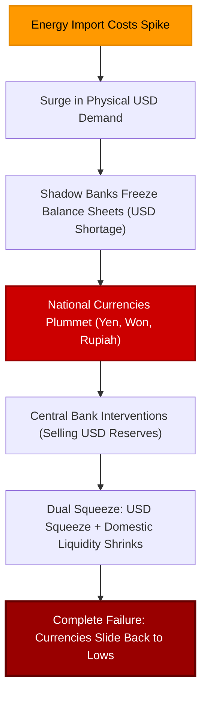

# Dollar Strength, Rate Crashes

The US dollar is surging once again, and the resulting economic pressure is vibrating violently across the Asian continent. 


<!-- truncate -->

The Japanese Yen is sliding back toward the abyss. The South Korean Won is deteriorating. The Indonesian Rupiah has plummeted to a new record low. And the Indian Rupee continues to squeeze domestic policymakers. 

But while the financial media fixates on this "strong dollar" narrative, the front end of the US dollar interest rate market is doing something incredible, shocking, and entirely counterintuitive: **it is actively hedging and pricing in lower short-term interest rates in the future.**

This is the ultimate paradox of the current macroeconomic cycle. The dollar is not rising because the world is confident in US economic growth; it is rising because the global shadow banking system is starved of dollar liquidity. And short-term US rate markets are not falling because everything is fine; they are falling because they are starting to price in the severe recessionary fallout of this global dollar squeeze.

---

## The Interest Rate Differential Fallacy

The mainstream financial press relies on a simple, comforting explanation for currency movements: *it is always about interest rate differentials.* 

They claim that because the Federal Reserve is keeping interest rates high, while the Bank of Japan and other Asian central banks remain relatively low, capital is naturally fleeing Asia to capture higher US yields. 

But there is a massive flaw in this textbook argument. 

Over the past year, the Bank of Japan has aggressively hiked rates, officially exiting its negative interest rate policy and letting JGB yields surge. Yet, the Yen is significantly *weaker* today than it was when Japanese rates were deeply negative. In Indonesia, the central bank surprised markets with an aggressive 50-basis-point hike to defend the Rupiah—yet the currency continued to slide to record lows anyway. 

```
   Interest Rate Fallacy:
   ┌────────────────────────────────────────────────────────┐
   │ Mainstream Narrative:                                  │
   │ Higher domestic rates = Stronger national currency     │
   ├────────────────────────────────────────────────────────┤
   │ Eurodollar Reality:                                    │
   │ Hikes do nothing; structural USD shortage overrides    │
   │ central bank interest rate policies                    │
   └────────────────────────────────────────────────────────┘
```

The rising dollar is not a speculative game driven by interest rate arbitrage. It is a fundamental **balance of payments crisis** triggered by a structural shortage of offshore ledger dollars.

---

---

## Energy Shocks and the Dollar Demand Loop

To understand why Asian currencies are collapsing, we must look at the real economy's transmission mechanism: **Energy**.

Resource-starved Asian nations—like Japan, South Korea, and India—are massive net importers of oil, natural gas, and other raw commodities. Because the global oil market is priced exclusively in US dollar ledger entries, any spike in energy prices (due to geopolitical escalations or supply chain frictions) has a dual effect:

1. **Physical Import Cost Surges:** Importers must immediately secure a far larger volume of US dollars to purchase the same physical quantity of oil needed to run their factories and cities.
2. **Systemic Dollar Shortage:** Importers must sell their local national currencies (Yen, Won, Rupee) to buy those dollars. 

If the offshore shadow banking system (the Eurodollar network) were expanding its balance sheets, it would easily supply these dollars. But because global commercial banks are contractionary and highly risk-averse, they refuse to provide new dollar credit. 

This creates an intense, mechanical scramble for dollars. National currencies collapse not because of interest rate spreads, but because importers are forced to dump their local currencies to buy the dollars required to keep their power grids alive. 

In India, this pressure has become so severe that the government is actively restricting gold and silver imports. Culturally, the Indian public buys precious metals as a hedge against currency decay. But from the government’s balance of payments perspective, buying gold is a luxury that leaks physical dollars out of the country. These restrictions are not a policy choice; they are the ultimate admission of a structural dollar shortage.

---

## The Illusion of Central Bank Intervention

Faced with currency collapse, Asian policymakers are desperately trying to project control. 

The Bank of Japan has burned through tens of billions of US dollar reserves in spot interventions. The Reserve Bank of India has accumulated a record **$103 billion** net short position in dollar derivatives. 

But these interventions have a rapidly shrinking half-life. 



Interventions do not create new offshore dollars. They simply reshuffle existing liquid reserves temporarily. When a central bank sells USD to buy its own currency, it actually drains domestic bank liquidity. 

This leaves the country trapped in a dual squeeze: **external dollar distress** and **internal monetary contraction**. By the time the third or fourth intervention occurs, currency traders realize the central bank is simply burning through its limited ammunition, and the downward pressure returns.

---

## The US Short Rate Paradox

This brings us to the most critical part of the puzzle. While currency markets are screaming about a dollar shortage, the front end of the US dollar yield curve is signaling a massive economic pivot.

Despite hawkish rhetoric from Federal Reserve officials—and mainstream fears that rising energy costs will trigger a sustainable "second wave" of consumer price inflation—short-term US dollar interest rate markets are hedging heavily for lower rates:

* **Treasury Bill Yields Plunge:** Yields on short-term US Treasury bills (such as the 1-month and 3-month tenors) are drifting lower, reflecting a desperate demand for safe collateral.
* **SOFR Futures Rally:** Secured Overnight Financing Rate (SOFR) futures, which track the market's expectation of overnight funding rates, are actively pricing in lower interest rates in the quarters ahead.

```
  US Front-End Yield Behavior:
  ┌──────────────────────────────────────────────────────────┐
  │ 1-Month T-Bill Yields      : Plunging (Collateral demand)│
  │ SOFR Futures Prices        : Rising (Pricing lower rates)│
  │ 10-Year Bond Yields        : Volatile (Inflation fears)  │
  └──────────────────────────────────────────────────────────┘
```

This is the exact same market behavior that occurred in **2008** and **2011**. 

In both instances, central bankers (like ECB President Jean-Claude Trichet) looked at rising oil prices, panicked about "headline inflation," and hiked interest rates directly into the teeth of a systemic banking crisis. The front end of the interest rate market warned that they were making a catastrophic mistake—that rising energy costs are a tax on growth, not a sustainable demand-driven expansion. 

The market was right then, and it is right now. A dollar squeeze and high energy prices do not create persistent inflation; they crush corporate margins, destroy household purchasing power, freeze trade credit, and trigger global recessions. 

We are already seeing the early signs of this growth shock in the United States, with major retail and logistics giants like **Lowe's, Kroger, Walmart, and S&P Global** warning of a rapid slowdown in consumer spending and corporate revenues.

---

## Conclusion: The Ultimate Warning

The combination of a rising US dollar exchange rate and falling US short-term interest rate expectations is not a contradiction. It is the definitive warning sign of a systemic macro squeeze.

The dollar is rising because the global offshore ledger system is starved of liquidity. Short-term rates are falling because the market sees the economic damage this shortage is actively inflicting on the global economy. 

As the energy shock and the Eurodollar deficit continue to squeeze Asian importers, the damage will inevitably transmit back to the US domestic economy. Central bank technocrats will continue to look at lagging CPI indicators and pretend they can guide the system with a few policy dials. But the front end of the dollar curve has already read the ledger: the fictional recovery is ending, and the global recessionary trap is closing.

---
*This analysis is part of our Global Macro series, focusing on credit markets, shadow banking plumbing, and systemic corporate debt cycles.*

---
_Monitor global market regimes and institutional credit flows in real-time with [Dashboard Options](https://dashboardoptions.com/)._
