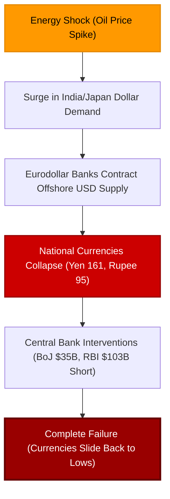

# FX Interventions Fail: The BoJ and RBI Dollar Squeeze

The Japanese government, through the Bank of Japan, has lit a match to **$34.5 billion (5.4 trillion yen)** and thrown it directly into the garbage. As if this public embarrassment were not enough, officials in Tokyo are now discussing intervening in the crude oil futures market. 


<!-- truncate -->

Meanwhile, on the other side of Asia, the Reserve Bank of India (RBI) has accumulated a record **$103 billion** short position in US dollar derivatives to defend the Rupee. Yet, despite these extreme interventions, the Indian Rupee fell to a new record low of **95 per dollar** on Friday, and the Yen is sliding back toward the abyss. 

These massive, coordinated interventions are failing for one simple reason: central banks do not control the global offshore ledger currency. We are living in a **Eurodollar world**, and central bank interventions are nothing more than elaborate puppet shows designed to hide their complete powerlessness.

## The Bank of Japan's Fictional "Line in the Sand"

For weeks, currency markets speculated about whether the Ministry of Finance and the Bank of Japan would step in to stop the Yen's decline. On Thursday, they finally acted. 

As the Yen slid past **161 per dollar**—breaching Tokyo's psychological "line in the sand" of 160—officials stepped into the foreign exchange market:
* **The Intervention:** Tokyo sold approximately 5.4 trillion yen ($34.5 billion) of its US dollar reserves.
* **The Immediate Reaction:** The Yen surged from 161 back to **155 per dollar** in a matter of hours.
* **The Reality:** Within days, the Yen began to slide right back toward 160. 

This is a carbon copy of the Japanese interventions in **April 2024** (where they burned through 10 trillion yen, only to see the Yen drop even further by July) and their failed interventions in **2022**. 

```
  Japanese FX Interventions vs. Yen Reality:
  ┌──────────────────────────────────────────────────────────┐
  │ 2022 Intervention: Fails to halt long-term Yen decline   │
  │ April 2024 (10T Yen): Completely erased within 3 months  │
  │ May 2026 (5.4T Yen) : Brief bounce, Yen slides back to 160│
  └──────────────────────────────────────────────────────────┘
```

Top currency official **Atsushi Mimura** and Minister of Finance **Satsuki Katayama** warned speculators, even telling journalists to "keep their smartphones close" before the intervention. 

But their warnings ignore the basic plumbing of the system. The Yen's weakness is not a psychological problem created by currency speculators—it is a **fundamental Eurodollar supply crisis**.

## The Interest Rate Fallacy

Mainstream financial media remains stubbornly fixated on the **interest rate differential** argument. They claim the Yen is weak because US interest rates are higher than Japanese rates, encouraging capital to flee Japan.

This explanation is factually incorrect. Over the past year, the Bank of Japan has aggressively hiked rates, exited negative interest rate territory, and allowed 10-year Japanese Government Bond (JGB) yields to surge. 

Yet, the Yen is significantly *weaker* today than it was when Japanese rates were deeply negative. 

The Yen is not falling because of interest rates; it is falling because **the global economy is starved for dollars**, and Japan is paying the price through its massive energy import requirements.

## The Ultimate Desperation: Intervening in Oil Futures

Japan imports **90%** of its petroleum from the Middle East. When oil prices spike due to geopolitical escalations (such as the US-Iran proxy conflict and Strait of Hormuz tensions), Japan faces a dual crisis:
1. **The physical loss of oil:** Disruptions in oil shipping lanes limit physical supply.
2. **The explosion in dollar demand:** To buy the remaining, higher-priced oil, Japanese importers must secure an immense volume of USD ledger entries. 

Because global Eurodollar banks are contractionary and highly risk-averse, they refuse to supply new dollars. To get those dollars, Japanese institutions must sell Yen, driving the currency to historic lows.

In a state of pure desperation, Atsushi Mimura announced that Japan is prepared to **intervene in the crude oil paper (futures) market**. 

Their plan is to aggressively short oil futures to artificially suppress the price of oil, hoping to reduce their domestic dollar import bill. 

This is incredibly foolish. To fight what they call "speculative" oil prices, the Japanese government is planning to become the biggest speculator in the world. Burocrats will try to out-speculate institutional trading desks in the complex, highly leveraged paper futures market—a strategy that has never succeeded in financial history.

## India's Record $103 Billion Short Dollar Failure

The Reserve Bank of India (RBI) is proving this exact point. Unlike Japan, which typically intervenes in the spot market, the RBI has focused its defense of the Rupee on the **offshore Non-Deliverable Forward (NDF) and derivative markets**.

According to Bloomberg analysis of RBI data, India’s net short position in US dollars reached a record **$103 billion** in March—jumping by **$25 billion** in a single month. 

The RBI is effectively using massive leverage in the derivative market to support the Rupee against the oil-driven dollar squeeze. 

And what did this record-breaking $103 billion intervention achieve? **Nothing.** 

On Friday, the Indian Rupee collapsed to yet another record low of **95 per dollar**. 



## The Real Problem: The Offshore Ledger Supply Squeeze

The mainstream financial press will never talk about the **supply of Eurodollars**. They operate under the illusion that because the Federal Reserve printed trillions of bank reserves, there is a global surplus of dollars. 

But offshore Eurodollars are created and circulated exclusively by the balance sheet capacity of **global commercial banks**, not the Federal Reserve. 

Currently, global Eurodollar banks are actively contracting their balance sheets due to rising systemic risks:
* **The private credit collapse:** Leveraged shadow banking loans are defaulting globally.
* **The flat payrolls cycle:** Flat or contracting global employment is squeezing corporate revenues and driving defaults.
* **China's structural contraction:** The deep slowdown in China is drying up global trade liquidity.

Because global banks are in defensive, deleveraging mode, they are hoarding USD funding. Importers in Japan and India are forced to pay exorbitant prices for dollars, driving their national currencies into the ground.

## Conclusion

FX interventions are completely useless because central banks cannot print offshore Eurodollar ledger currency. The Bank of Japan’s $35 billion spot intervention and the RBI’s record $103 billion derivative short are nothing more than expensive distractions.

As the combination of the energy shock and the private credit contraction continues to squeeze the offshore banking system, the global dollar shortage will only worsen. Japan's threats to short the oil paper market are the ultimate admission of impotence. In the Eurodollar world, governments are not the drivers—they are simply passengers waiting for the bubble to pop.

---
*This analysis is part of our Global Macro series, focusing on credit markets, shadow banking plumbing, and systemic corporate debt cycles.*

---
_Monitor global market regimes and institutional credit flows in real-time with [Dashboard Options](https://dashboardoptions.com/)._
