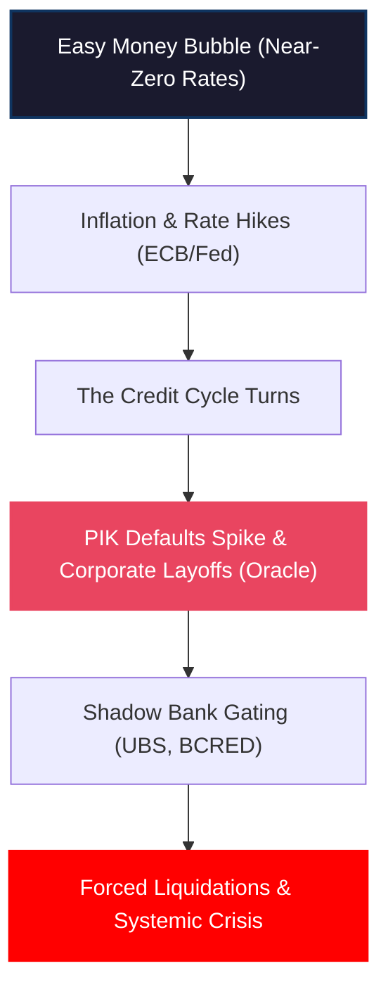

# Oracle Layoffs: Credit Cycle Turns as Bubbles Burst

Tech giant Oracle has announced that it will lay off thousands—if not tens of thousands—of its employees in a desperate bid to preserve cash. Remember, not so long ago, a company of Oracle’s size could borrow any insane, astronomical sum of money they wanted at near-zero interest rates. Those days are officially over. This announcement is yet another clear, undeniable confirmation that the credit cycle has turned, and it has turned aggressively. 

<!-- truncate -->

This corporate retrenchment is not occurring in a vacuum. Throughout the global credit markets, we are witnessing structural failures that point to the same inescapable conclusion: the bubble is deflating. From Fitch's warning on Payment-in-Kind (PIK) defaults to UBS gating retail investors in Europe, the liquidity that once lubricated the global financial system is evaporating. 

We are watching a classic, textbook asset bubble transition into a bust, and if systemic pressures continue to build, that bust will inevitably transform into a full-scale financial crisis.

## Oracle's Layoffs: The Death of Cheap Debt

For more than a decade, large corporations operated under a simple paradigm: cash flow was secondary to market share because capital was effectively free. If a corporation needed liquidity, it simply tapped the bond market, issued investment-grade paper at negligible spreads, and rolled over its existing debt indefinitely.

Oracle's decision to slash its workforce by thousands of jobs is a direct response to the ending of this era. Preserving cash is no longer a choice; it is a necessity for corporate survival. When the credit cycle turns:
* **Borrowing costs rise:** Rolling over existing debt becomes highly expensive.
* **Capital becomes discerning:** Lenders demand actual cash flows, not just promises of future growth.
* **Liquidity hoards grow:** Companies must aggressively cut operating expenses (opex) to preserve cash on hand.

Oracle's layoffs are a systemic signal. If a tech titan with massive recurring database revenues is forced to aggressively cut headcount to preserve cash, imagine the pressure building on highly leveraged, middle-market enterprises that rely entirely on the private credit markets.

## Fitch Warns: PIK Defaults Hit a 14-Year High

The stress is not confined to the tech sector; it is pulsating through the plumbing of corporate debt. Fitch Ratings recently reported that **Payment-in-Kind (PIK)** defaults have reached their highest level in 14 years.

To understand why this is catastrophic, we must understand what PIK debt actually is. Payment-in-Kind is a mechanism that allows a struggling borrower to pay its interest not with cash, but by **issuing more debt**. It is the ultimate form of kicking the can down the road:
1. A company borrows money but cannot generate enough cash to pay the interest.
2. Under a PIK agreement, the borrower says: *"Instead of paying you $10 million in cash interest this quarter, I will add $10 million to the principal of my loan, and I will pay interest on that larger sum in the future."*
3. The lender agrees, preserving the illusion that the loan is performing.

PIK debt is the primary tool private credit funds and shadow banks use to hide defaults. By letting borrowers "pay in kind," they keep non-performing loans off their books and avoid reporting losses to their investors.

But when PIK defaults hit a **14-year high**, it means the music has stopped. Companies have piled on so much compounding, non-cash debt that the capital structure has become completely unsustainable. They can no longer afford to paper over their insolvency even with fake, non-cash debt. The paper tower is collapsing.

## UBS Gates European Investors: The Liquidity Trap

As corporate defaults rise, the vehicles that funded this debt are starting to lock their doors. A real estate and private debt fund in Europe managed by **UBS** has recently gated its investors, freezing redemptions for **up to three years**.

This is a classic manifestation of the **liquidity mismatch** that defines every shadow banking bubble. These funds offer their retail investors relatively frequent redemption options (monthly or quarterly) but invest those funds in highly illiquid, long-term private loans or commercial real estate assets.

When the macro environment deteriorates, investors panic and demand their money back. But the fund cannot easily liquidate private corporate debt or an office building without accepting a massive, ruinous discount. To avoid a forced liquidation spiral:
* **The fund locks the doors (gates redemptions):** Investors are told they cannot touch their money for three years.
* **Trust evaporates:** The moment a fund gates, it signals to the market that the underlying assets are impaired and cannot be sold at their reported book value.
* **Contagion spreads:** Investors in other, similar funds panic and pre-emptively submit redemption requests before those funds gate as well, creating a run on the shadow banking system.

We saw this exact script play out with Blackstone's BCRED fund and Blue Owl Capital. Now, UBS's European fund is executing the same defensive maneuver.

## The Textbook Trajectory: Bubble to Crash to Crisis

What we are witnessing is the standard, historical trajectory of a major credit cycle peak:

Every financial crisis starts as a minor credit squeeze. In the early stages (where we are now), the losses seem manageable. Proponents of the shadow banking sector will tell you that Oracle's layoffs are company-specific, that Fitch's PIK data is backward-looking, and that UBS's gated fund is an isolated European real estate issue.

This is the same denial that characterized Bear Stearns in early 2007. They argue that the financial system is well-capitalized and that the distress is contained. 

But they ignore the plumbing. Once defaults spike, banks and shadow lenders contract credit. When credit contracts, companies cannot roll over their debt. When they cannot roll over their debt, they lay off workers and cut investment. This creates a recession, which drives defaults even higher—a self-reinforcing, deflationary loop that defies the simple math of spreadsheet projections.

## Conclusion

The turn in the credit cycle is no longer a theoretical debate; it is a daily reality. Oracle’s layoffs prove that even investment-grade tech giants are feeling the squeeze. Fitch's PIK data proves that the hidden leverage in corporate capital structures is exploding. UBS's gated fund proves that the liquidity backstops are failing.

We are in the classic transition phase where a historic bubble is actively turning into a crash. If central banks and regulators continue to ignore these structural failures in the shadow banking system—focusing instead on transient energy inflation—the crash will inevitably turn into a systemic crisis that no rate cut will be able to easily fix.

---
*This analysis is part of our Global Macro series, focusing on credit markets, shadow banking plumbing, and systemic corporate debt cycles.*

---
_Monitor global market regimes and institutional credit flows in real-time with [Dashboard Options](https://dashboardoptions.com/)._
