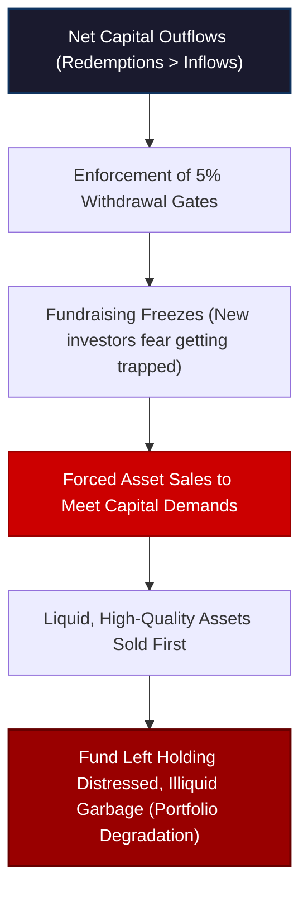

# Private Credit Squeeze: Outflows Exceed Inflows

For the first time in the history of the modern private credit boom, the volume of capital exiting private credit vehicles has officially surpassed the volume of capital coming in. 


<!-- truncate -->

This is the ultimate headline of the current credit cycle. It is not an isolated bad loan, a single troubled borrower, or minor valuation questions. It is the plumbing of the shadow banking system itself going in reverse. 

The private credit boom was built on a very simple, optimistic premise: *capital will continue to flow into these funds forever.* But that premise has shattered. Non-traded Business Development Companies (BDCs) and private funds are facing persistent redemptions that outpace new fundraising, forcing managers to consider selling assets—a reality the asset class was never structurally designed to handle.

We have officially entered the most dangerous phase of **Stage 2**, where illiquidity meets the cold mathematics of net capital outflows and forced market price discovery.

---

## The Mathematics of the Liquidity Reversal

According to a recent Q1 report by Robert Stanger & Co., non-traded private credit BDCs returned more capital to investors than they successfully raised from new participants:
* **The Outflow:** Unlisted BDCs returned approximately **$7 billion** to redeeming investors during the first quarter.
* **The Inflow:** These same vehicles raised only **$5 billion** in new equity capital.
* **The Gap:** A net capital exit of **$2 billion** in a single quarter.

```
   Non-Traded BDC Q1 Capital Flows:
   ┌────────────────────────────────────────────────────────┐
   │ Total Redemption Requests         : $15 Billion        │
   ├────────────────────────────────────────────────────────┤
   │ Capital Paid Out to Investors     : $7 Billion         │
   ├────────────────────────────────────────────────────────┤
   │ New Capital Raised (Inflows)      : $5 Billion         │
   └────────────────────────────────────────────────────────┘
```

Total redemption requests in the first quarter actually exceeded **$15 billion**. Because BDCs restrict withdrawals to protect their underlying assets, they enforced a **5% quarterly gating limit**, leaving billions of dollars of investor capital effectively trapped. 

Non-traded BDCs were sold to retail and institutional wealth management channels on a highly seductive pitch: capture high institutional yields with stable, model-based NAVs and avoid public market volatility, with the comfort of periodic redemption windows. 

But the underlying assets are highly illiquid corporate loans. If inflows exceed outflows, the fund can easily satisfy exiting investors using the cash provided by new entrants without ever touching the loan portfolio. 

But when the math flips, the fund must find liquidity from other sources: cash reserves, bank leverage facilities, or outright asset sales. 

---

---

## The Gating Trap and Portfolio Degradation

Defenders of private credit argue that gating limits protect the fund from "run-on-the-bank" scenarios. They point out that these structures prevent managers from being forced to fire-sell assets.

But this argument ignores human behavior. Gating redemptions does not remove the pressure—it simply delays it. 

If investors want to withdraw capital and find themselves gated, they do not change their minds; they wait in line for the next redemption window. Meanwhile, news of the gating spreads, making new investors highly hesitant to commit capital. As new fundraising slows to a crawl while redemptions remain maxed out, the liquidity squeeze deepens.

This forces the fund to begin selling parts of its loan portfolio to meet cash demands. And in a liquidity crisis, funds do not sell the assets they *want* to sell—they sell the assets they *can* sell. 



The easiest loans to sell in the secondary market are the highest-quality, most standard, and healthiest assets on the books. Stressed, highly leveraged, or distressed loans are virtually impossible to liquidate without taking devastating, NAV-crushing write-downs. 

Consequently, a gated fund is forced to liquidate its crown jewels to pay off exiting investors, leaving the remaining participants holding a degraded portfolio of illiquid, problematic corporate debt. 

---

## Price Discovery at 65 Cents on the Dollar

When private credit funds are forced to trade assets in the secondary market, the theoretical world of "Mark-to-Legend" meets the brutal reality of price discovery. 

In a recent earnings call, the management of **New Mountain Finance** (a prominent BDC) revealed a highly revealing anecdote. They reported purchasing a corporate debt position in the secondary market at approximately **65 cents on the dollar**—only for the position to trade up 10 cents a few weeks later. 

While New Mountain framed this as a highly successful opportunistic trade, it exposes a massive valuation crisis. 

```
   Valuation Gap (Fictional vs. Real):
   ┌────────────────────────────────────────────────────────┐
   │ Reported NAV (Model Mark):                             │
   │ Fund models assets near par (~95 - 98 Cents)           │
   ├────────────────────────────────────────────────────────┤
   │ Secondary Market Transaction (Real Price Discovery):   │
   │ Transaction executed at deep discount (~65 Cents)      │
   └────────────────────────────────────────────────────────┘
```

If a loan is being sold at 65 cents on the dollar in a real transaction, it means the seller was under severe distress or risk aversion. But more importantly, it poses an existential threat to every other fund holding similar corporate debt at 95 cents on the dollar. If the real-world clearing price for this credit risk is 65, then the reported NAVs of the entire industry are built on a fictional foundation.

---

## Rising Non-Accruals and Record Defaults

The cracks are no longer confined to small, marginal shadow lenders. They are appearing in the absolute core of Wall Street:

* **Goldman Sachs Non-Accruals Spike:** During the first quarter, a major publicly traded private credit BDC managed by **Goldman Sachs** placed two additional corporate borrowers on non-accrual status. Non-accrual loans (where the borrower has stopped making interest payments) jumped to **4.7% of the portfolio at cost**—a sharp rise of **1.9 percentage points** in a single quarter.
* **Fitch Ratings Record Defaults:** Fitch Ratings reported that the US private credit default rate reached a record high of **6.0% in April 2026**—a clear, macro-level confirmation that corporate insolvencies are accelerating across the entire mid-market space. 
* **HSBC Pauses $4 Billion Private Credit Drive:** HSBC, one of the world's largest commercial banks, has quietly paused its plan to deploy a major $4 billion private credit investment strategy, citing deteriorating risk parameters.
* **AMP Australia Cuts Exposure:** In Australia, wealth manager AMP announced it is aggressively reducing its exposure to "foamy" and overvalued private credit assets to protect its balance sheet.

---

## Conclusion: The Squeeze is Systemic

The private credit bubble was built on a series of carefully constructed myths: that private debt is insulated from the economic cycle, that daily market valuations are unnecessary, and that long-term assets can be successfully funded with short-term retail liabilities.

As the Deutsche Bank credit desk recently noted: lola (if it weren't for) the intense focus on Middle Eastern geopolitical tensions, this private credit liquidity freeze would be on the front pages of every financial newspaper in the world.

The transition to Stage 2 is complete. When capital exits the shadow banking system faster than it enters, managers are forced to liquidate their best assets, and forced secondary market sales expose the massive gap between fictional marks and real-world discounts. The private credit squeeze is no longer a localized accounting issue—it is a systemic contraction of credit that will reverberate deeply across the real economy.

---
*This analysis is part of our Global Macro series, focusing on credit markets, shadow banking plumbing, and systemic corporate debt cycles.*

---
_Monitor global market regimes and institutional credit flows in real-time with [Dashboard Options](https://dashboardoptions.com/)._
