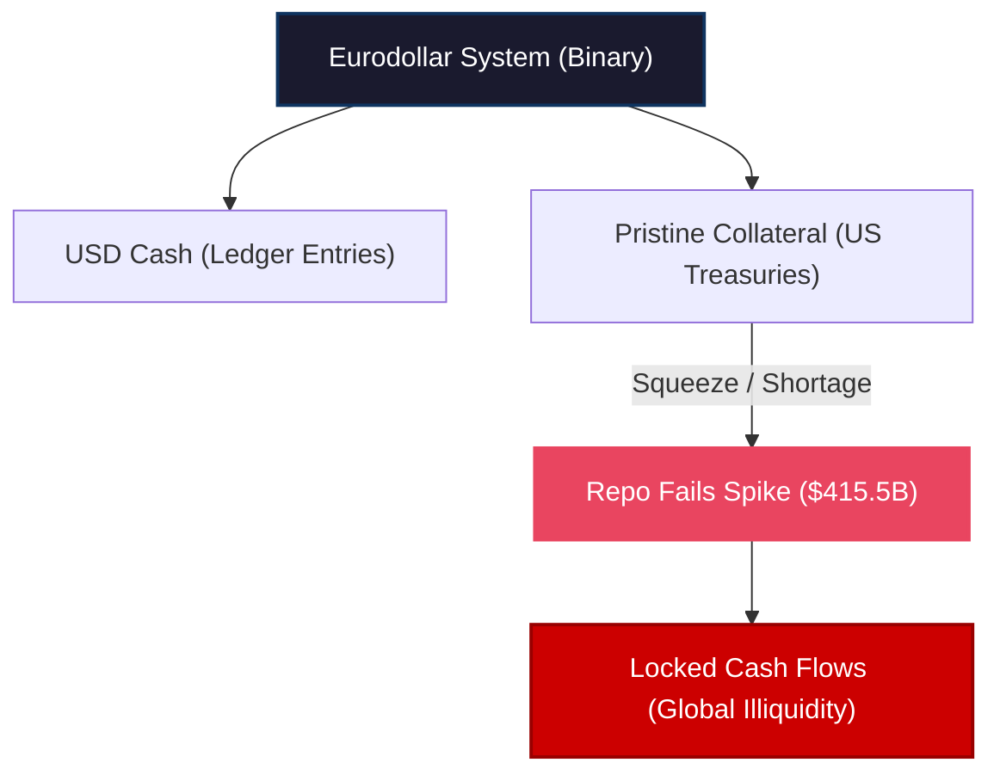

# Repo Fails Hit $415B: The Global Collateral Squeeze

Total failures to deliver in the US repurchase agreement (repo) market have exploded, surging past **$415.5 billion** in the first week of April. Meanwhile, Treasury bill yields are tumbling as financial institutions scramble for high-quality collateral, and foreign central banks are liquidating their reserves at an alarming pace. 


<!-- truncate -->

These dynamics are sending clear signals across the shadow Eurodollar system: a severe shortage of pristine collateral is squeezing global banking plumbing. This squeeze has nothing to do with Federal Reserve interest rate policy, except that the Fed provides the data that exposes the crisis. 

To understand why this is happening and what it actually means, we must look beyond the standard domestic narrative and trace the pipes to an unexpected source: **Nigeria**.

## The Binary Nature of the Eurodollar System

The offshore Eurodollar system is fundamentally **binary**. To function and keep global credit flowing, the system requires two interconnected halves:
1. **Cash (Ledger Entries):** Denominated in USD, residing on the balance sheets of global financial institutions.
2. **Collateral (Pristine Debt):** Primarily US Treasury bills and bonds, used to secure loans and clear transactions.

If collateral does not flow smoothly through the repo market, cash cannot move either. They must work in tandem. 

When the flow of collateral breaks down, we witness a surge in **"repo fails"**—transactions where one party fails to deliver the promised US Treasury securities to complete the exchange. 

According to the Federal Reserve Bank of New York’s weekly Primary Dealer Survey, total repo fails jumped to **$415.5 billion** for the week beginning April 1. This is the highest level since the mid-December liquidity squeeze. 

While mainstream commentators will point out that this week coincided with the end of the quarter (when balance sheets typically contract), comparing it to the same week in 2025—when fails were under **$190 billion**—exposes a profound, underlying stress. This is not a simple calendar anomaly; fails had already spiked to **$380 billion** two weeks prior (the week of March 18).



## The "Shorting" Myth vs. True Collateral Scarcity

Whenever repo fails spike, the mainstream financial press immediately serves up a standard excuse: traders are aggressively shorting US Treasuries. 

To short a bond, a trader must first borrow it in the repo market. If a massive volume of traders all try to borrow the same specific Treasury note simultaneously, it creates localized shortages, causing repo transactions to fail. 

This explanation was highly plausible in mid-March. At that time, global central banks were striking a hawkish tone:
* The **Reserve Bank of Australia (RBA)** had hiked rates for the second consecutive time.
* The **Bank of England (BoE)** and **ECB** were actively discussing rate hikes.
* Treasury yields were rising rapidly, encouraging traders to short the market.

But by early April, that narrative had completely dissolved. On **March 27**, the bond market made a massive U-turn: yields peaked and began sliding down as bond prices rallied. 

The latest spike in repo fails occurred while yields were falling, indicating that institutions were aggressively *buying* and *holding* Treasury bills for safety. This is the signature of a **systemic collateral shortage**, not a speculative short-covering wave.

## Yields Collapse in the T-Bill Market

When collateral is scarce, financial institutions will pay any price to acquire T-bills, pushing their prices up and their yields down. 

This is exactly what we observed in early April. According to US Treasury data, the yield on the 4-week Treasury bill sat stable at **3.74%** for weeks. But as the repo fails data hit the tape, the yield began a steep decline:
* **April 1:** Yields began to slip as fails hit $415.5 billion.
* **April 8:** The 4-week yield fell to **3.67%**.
* **April 10:** The yield plummeted to **3.64%**—a massive **10 basis point drop** in a market where moves are usually measured in fractions of a basis point.

Similar downward moves occurred in the 8-week bill and the 3-month Treasury bill (which dropped by 6 basis points). 

These highly unusual yield drops represent a panic bid for collateral. Institutions are willing to accept lower and lower yields just to get their hands on pristine T-bills to secure their balance sheets.

## The Energy Shock and the Dollar Squeeze

This intense collateral scramble is the direct consequence of the **geopolitical energy shock** that has since transformed into a **global dollar squeeze**.

When oil prices spike due to Middle Eastern tensions (specifically around the Strait of Hormuz), the macro loop is simple:
1. **Oil importers need more dollars:** To purchase the same physical volume of crude, importing countries suddenly require a massive, unexpected increase in USD liquidity.
2. **They scramble to the Eurodollar market:** Importers turn to global commercial banks for short-term dollar funding.
3. **Banks contract credit:** At the same time, global Eurodollar banks (especially in Europe) are facing private credit losses and economic contraction. Becoming highly risk-averse, they refuse to supply new dollars without pristine collateral.

## The Nigerian Mirror: Oil Exporters Squeezed Too

To help domestic companies and oil importers who cannot secure funding on their own, foreign central banks are forced to mobilize their reserves. They sell their liquid Treasury holdings to generate cash and lend it locally. 

We saw this dynamic in East Asia last week with **Taiwan** and **Indonesia**. But the ultimate proof of this global squeeze comes from **Nigeria**—a major OPEC member and oil exporter.

Logically, an oil exporter should be drowning in USD inflows during an energy shock. But Nigeria’s central bank had to do the exact opposite. 

According to data compiled by Bloomberg, Nigeria’s foreign exchange reserves **declined for 16 consecutive days** leading up to April 8—the longest continuous drop since July 2025. The Central Bank of Nigeria's reserves fell by **$1.1 billion** to just under **$49 billion**. 

Nigeria’s central bank had to liquidate its Treasury holdings to support its domestic currency, the Naira, and provide USD liquidity to its financial system. 

Why? Because the shortage of USD funding is so severe and global that even oil-exporting nations are finding it difficult and expensive to secure Eurodollar credit. The supply of offshore dollars has contracted globally.

## A $107 Billion Liquidation Wave

The New York Fed’s custody holdings data confirms the scale of this global intervention. Since mid-February, foreign official institutions have liquidated or mobilized a staggering **$107.7 billion** in US Treasury holdings. 

To put this in perspective:
* **The 2023 Banking Crisis:** Foreign central banks liquidated **$87 billion** in Treasuries.
* **The March 2020 Pandemic Panic:** They liquidated **$161 billion**.

We are currently witnessing a liquidation wave that far exceeds the 2023 banking crisis and is rapidly approaching the systemic panic levels of March 2020. 

```
  USD Reserve Liquidations (Comparison):
  ┌──────────────────────────────────────────────────────────┐
  │ March 2020 (Pandemic Panic)       : $161 Billion         │
  │ Current Squeeze (Mid-Feb to Apr)  : $107.7 Billion       │
  │ March 2023 (Banking Crisis)       : $87 Billion          │
  └──────────────────────────────────────────────────────────┘
```

## Conclusion

The massive spike in repo fails and the scramble for short-term Treasury bills are clear warnings that the global financial plumbing is severely constricted. 

Even if geopolitical tensions ease and oil prices stabilize, the underlying structural issues will not disappear. The combination of a cooling global economy (driven by China's deep structural slowdown) and the ongoing unwinding of the private credit bubble will keep Eurodollar lenders extremely defensive. 

The Eurodollar system is starved for pristine collateral, and as central banks continue to deplete their Treasury reserves to fight the dollar shortage, the squeeze in repo plumbing will only intensify.

---
*This analysis is part of our Global Macro series, focusing on credit markets, shadow banking plumbing, and systemic corporate debt cycles.*
