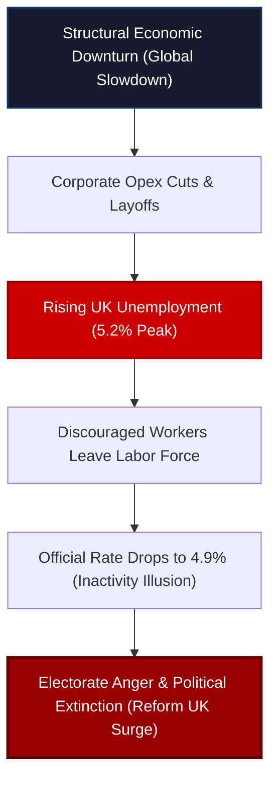

# UK Political Earthquake: The Price of Flat Payrolls

Two of the oldest and most dominant political parties in the Western world—the Conservative Party and the Labour Party—are facing the very real threat of complete electoral extinction in the United Kingdom. 


<!-- truncate -->

The results of last week's UK local elections were a total, unmitigated bloodbath for the political establishment. A political realignment of historic proportions is underway, and it is driven by a simple, undeniable macroeconomic law: **when the rate of change in the economy drops, the rate of change in politics spikes.** 

Establishment politicians are desperately trying to blame their losses on temporary, short-term issues. But the reality is far simpler and deeper: the "Kitchen Table" economy is broken, and the working class has reached its limit.

## The Extinction Event: The Numbers of Realignment

The local council elections in the United Kingdom produced a political shift that is simply historic. For anyone outside the UK, these local elections serve as a massive nationwide midterm poll—a crucial health check on where the electorate stands between major national general elections. 

In 2024, the British public swept **Keir Starmer** and the Labour Party into government with a massive parliamentary majority, completely rejecting the Conservatives after more than a decade of economic stagnation. Labour won on a simple promise: *"We will fix the economy."*

Two years later, the public has delivered their verdict. Labour has been utterly decimated:
* **The Labour Collapse:** Labour lost nearly **1,500 council seats**, bleeding heavily in its most traditional, working-class heartlands.
* **The Tory Bleeding:** The Conservatives sank even deeper into the abyss, losing another **563 seats**, leaving them with a pathetic remnant of just 801. 
* **The Reform Surge:** **Nigel Farage’s Reform UK** party pulled off an unprecedented surge, exploding from just **2 seats to a staggering 1,453 seats**.
* **The Green Rise:** The left-wing Green Party also surged, capturing **441 seats**.

```
  UK Local Council Seats (Realignment):
  ┌──────────────────────────────────────────────────────────┐
  │ Reform UK Surge      : From 2 to 1,453 Seats             │
  │ Labour Collapse      : Lost nearly 1,500 Seats           │
  │ Conservative Bleed   : Lost 563 Seats (Only 801 left)    │
  └──────────────────────────────────────────────────────────┘
```

Establishment parties lost over **2,000 local council seats combined**, with three-quarters of those seats going directly to Reform UK. 

Nigel Farage declared that this was no longer a temporary "protest vote," but a permanent, national realignment of British politics. The traditional dominance of the two-party system has been broken, and the catalyst is purely economic.

## The Fallacy of the "Affordability Crisis"

Politicians and central bankers desperately avoid using the words **"unemployment"** or **"income collapse."** Instead, they hide behind the comfortable, clinical euphemism of an **"affordability crisis."** 

An "affordability crisis" sounds like a minor policy friction—something that can be easily resolved with a few tax credits, targeted energy subsidies, or minor adjustments to central bank rates. It shifts the blame away from structural economic failure and makes it look like a technical glitch.

But the working class knows the truth: **it is a jobs and income crisis.** 

While consumer prices spiked dramatically in 2021 and 2022, wages never caught up. Now, five years into this inflationary cycle, the situation has become far worse because the labor market is actively contracting. 

## The Hidden Rise of European Unemployment

Unemployment is rising rapidly across Europe, yet you will almost never hear it mentioned in mainstream financial media. To admit that unemployment is rising would expose the complete failure of the central bank narrative.

In the United Kingdom, the economic slowdown has become impossible to ignore:
* **UK Unemployment Spikes:** The official UK unemployment rate jumped to a new cycle high of **5.2% in January 2026**—the highest non-lockdown rate since the mid-2000s. 
* **The February "Inactivity" Illusion:** In February, the official rate ticked down to **4.9%**, which the government immediately celebrated as a recovery. But the detail exposes a grimmer reality: the drop was driven entirely by **economic inactivity**. Discouraged workers, finding no one hiring and facing continuous layoffs, simply gave up looking for work and dropped out of the labor force.



This labor decay is not confined to the UK; it is pulsating across the English Channel. 

In France, the National Statistics Agency (INSEE) reported that **French unemployment unexpectedly surged to a 5-year high of 8.1% in the first quarter of 2026**. 

This completely shocked mainstream economists (such as those surveyed by Bloomberg), who had confidently predicted a decline to 7.8%. 

Crucially, this surge in French unemployment occurred *after* the European Central Bank (ECB) aggressively cut interest rates to **2%** in 2025. 

According to mainstream textbooks, a 2% rate environment should have acted as a powerful, stimulative shield for the European economy. In reality, it did nothing. Rate cuts are not a cure for economic weakness; they are simply a lagging confirmation that the central bank is desperately reacting to a collapsing system.

## The Permanent Legacy of the Eurodollar Deficit

The economic collapse of the UK and Europe is not the fault of any single political party. It is the permanent, structural consequence of a decaying global financial system:
1. **The 2008 Eurodollar Break:** The global financial system never truly recovered from the 2008 shadow banking collapse. The structural supply of offshore dollar funding has been in a chronic deficit for nearly two decades.
2. **The Lockdowns Shock:** The extreme lockdowns and supply shocks of 2020 and 2021 permanently fractured corporate supply chains and balance sheets.
3. **The Flat Payrolls Trajectory:** Stressed employers, unable to secure affordable funding, responded by freezing hiring and slashing headcount, starting in mid-2024.

When Keir Starmer and Rishi Sunak promised that their specific parties could "fix the economy," they were lying. They had no understanding of why the system was broken, no comprehension of the Eurodollar deficit, and no tool to stop the structural rise in unemployment. They assumed that a few central bank rate cuts would give them a tailwind, but rate cuts cannot fix a insolvent system.

## Conclusion: The political price

The electoral earthquake in the United Kingdom is a stark warning to the global political establishment. 

You can use the media to manipulate the narrative, you can pretend the stock market represents the real economy, and you can call a deep income contraction an "affordability crisis." But you cannot deceive the voter at the kitchen table.

As the rate of change in the economy continues to drop, the political status quo will continue to shatter. Nigel Farage and Reform UK did not need a complex platform to win; they simply had to acknowledge the reality that the establishment has spent years trying to hide. Until politicians are willing to be honest about the structural decay of the global labor and credit markets, the political map of the West will continue to be redrawn.

---
*This analysis is part of our Global Macro series, focusing on credit markets, shadow banking plumbing, and systemic corporate debt cycles.*
