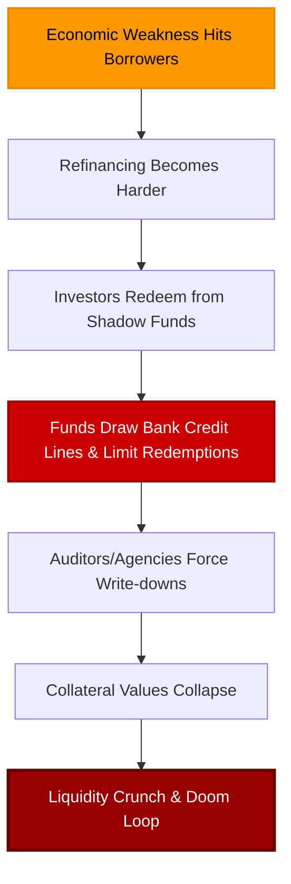

# European Banks Hoard Bonds: Preparing for Shadow Credit Bust

European banks are doing something that looks completely irrational on the surface. As we know, the European Central Bank (ECB) is likely to raise its short-term policy rate because oil prices remain elevated, feeding through into consumer price indices, and ECB officials are growing increasingly hawkish. 

The last thing you would expect banks to do if they thought short-term policy rates were going up is to buy fixed-rate government bonds. But that's exactly what European banks are doing—and in huge, unprecedented amounts. This represents a direct continuation of [banks hoarding safety as the credit crisis spreads](/blog/european-banks-hoard-safety-credit-crisis-spreads).

Banks are not positioning as if the main danger is inflation. They're not behaving as if the biggest risk is Christine Lagarde’s rate hikes causing bond prices to fall. They are behaving as if the bigger danger is what comes later: economic weakness, rising credit stress, liquidity pressure, and a possible private credit bust spreading through Europe's shadow banking system. In other words, this is safety over yield, safety over growth, and safety over central bank narratives.

<!-- truncate -->

---

## The Fragile Macroeconomic Backdrop

The real economy in Europe was already fragile before the latest energy shock. France recently reported a surprise contraction in GDP, household spending is falling, consumer confidence is at multi-year lows, and business activity is slumping. Germany remains stuck in a low-growth, manufacturing-heavy slump. 

Furthermore, these balance sheet actions coincide with major redemptions across alternative assets, where we see [private market contagion as private equity gates redemptions](/blog/private-market-contagion-private-equity-gating-redemptions) to preserve liquidity.

Higher energy prices don't create a durable inflation boom in this environment; they act as a tax. Consumers have less money left over, and businesses cannot absorb the costs. Volumes shrink, margins get squeezed, hiring disappears, and layoffs start. Europe is especially exposed because it is energy-import dependent, manufacturing-heavy, and already dealing with weak demand.

---

> ### Sponsor Spotlight: Block Trust IRA
> If you've ever wondered whether crypto belongs inside your retirement account, [Block Trust IRA](https://eurodcrypto.com) offers a managed crypto IRA solution.
> 
> Unlike self-directed platforms where you must handle all the buying, selling, and rebalancing, Block Trust IRA incorporates an active portfolio management strategy. Custody is provided through secure channels, and the platform has demonstrated strong historical performance compared to holding Bitcoin alone.
> 
> Eligible viewers can receive up to a $2,500 crypto bonus when opening and funding a new account. To learn more about the terms, conditions, and minimums, visit [eurodcrypto.com](https://eurodcrypto.com).
> 
> *Paid advertisement. Crypto assets are highly volatile and carry capital risk.*

---

## The Sovereign Bond Buying Spree

According to the latest data from the ECB, monetary financial institutions (MFIs) purchased a whopping **23.7 billion euros** worth of government bonds in April alone. This was not due to price increases; it was pure buying activity. 

This brings the year-to-date total to more than **175 billion euros**—the third most for any four-month period in the entire data series, behind only the crisis periods of 2020 and last year. 

What makes this compelling is that banks are piling into government securities while knowing the ECB is likely to raise rates. The deposit rate is already around the 2% area, and policy makers have plenty of cover to sound hawkish. 

Banks are choosing to buy government bonds because they are prioritizing balance sheet safety, liquidity, collateral, and regulatory compliance. Government bonds can be pledged, sold, and used to satisfy liquidity requirements. In a deteriorating economy, banks would rather take manageable mark-to-market risk in sovereign debt than credit risk in commercial real estate, consumer loans, or shadow bank exposures.

---

## Euribor Futures Curve: The Inverted Frown

This market caution is clearly visible in the **Euribor futures curve** (the forward rate market for euro short-term rates). Like US dollar SOFR futures, the Euribor curve is "frowning"—it prices in the risk of higher short-term rates in the near term (due to ECB hawkishness) followed by steep rate cuts further out. 

If this were a true, sustained inflation regime, the curve would steepen and remain elevated at the back end. Instead, Euribor futures are signaling short-term hawkishness, long-term economic contraction. The market is betting that the ECB's rate hikes will act as a policy error, making the eventual downturn worse. 

Outside the Eurozone, the pattern is the same:
*   **The UK**: The Bank of England has shifted its tone, suggesting it may tolerate higher short-term inflation because the labor market is softening. 
*   **Sweden**: The central bank remains highly cautious as GDP prints turn negative, warning of a potential [Swiss recession and global slowdown](/blog/switzerland-recession-global-warning).

---

## The Shadow Banking Strain in Europe

The shadow banking system in Europe is showing similar stage-two distress to what we are witnessing in the US. ECB monetary figures show that investment fund deposits at banks fell sharply in April, while bank lending to non-bank financial institutions (NBFIs) rose by **22.3 billion euros**. 

This combination tells a specific story: shadow banks are experiencing outflows and drawing down their bank credit lines to stay liquid. 

European banks provide the back leverage, repo financing, custody, and credit lines to these shadow lending vehicles. When the shadow banking complex gets squeezed, banks see the cracks first. 

Banks are hoarding sovereign bonds to build liquid buffers before the credit cycle fully turns. They are preparing for a macro sequence that is all too familiar: hike first, break later, and cut rates when the damage becomes too obvious to ignore. 

---

_Monitor global macroeconomic indicators, options volume, and liquidity regimes in real-time with [Dashboard Options](https://dashboardoptions.com/)._
