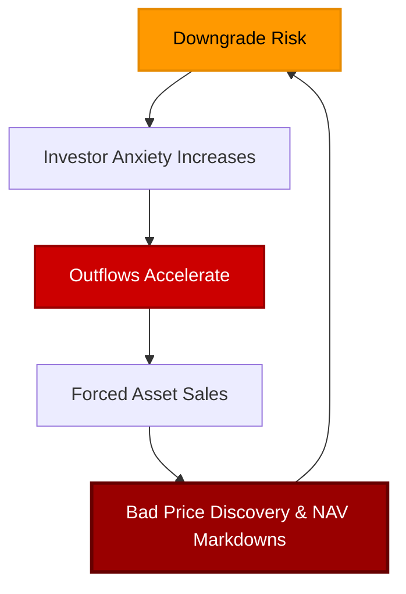

# Private Market Contagion: Private Equity Gating Redemptions

The private credit bust is no longer staying strictly inside private credit. We are getting signs of escalation and even contagion as investors are now pulling their money out of a major Swiss private equity fund. This is a massive shift, because all along, the industry narrative was that any downturn would be contained. 

Supposedly, it would only affect a few isolated private credit funds experiencing redemption pressures. A couple of non-traded Business Development Companies (BDCs) had to limit withdrawals, and flighty retail investors supposedly misunderstood the liquidity terms. The industry's defense was simple: this is not a credit crisis; it is just a liquidity education problem.

But now, that explanation is rapidly breaking down. The same redemption pressure that hit private credit is now showing up in private equity. 

<!-- truncate -->

---

## Switzerland's Partners Group Caps Withdrawals

Partners Group, one of Europe's largest alternative asset managers based in Switzerland, is capping withdrawals at its $8.6 billion Global Value Fund (an Evergreen private equity vehicle) after redemption requests surged to an estimated **9.8%** in the second quarter—nearly double the quarterly limit of 5% of net asset value (NAV).

This follows the recent shock of a [Swiss pension fund forcing redemption gates](/blog/private-credit-slump-swiss-pension-fund-gate) in a Vista private credit fund, signaling that the pressure is no longer just retail. 

Evergreen private equity funds were part of the same semi-liquid private markets boom. They gave investors access to private equity without the traditional 10-year drawdown fund structure. They were sold as a more flexible way to own private companies so investors could get exposure to private markets and still have some ability to redeem. 

But the "some ability" is doing a lot of work here because the underlying assets are completely illiquid. Private equity stakes cannot simply be sold instantly at the latest reported NAV. The fund owns positions in private companies, co-investments, secondaries, and other illiquid assets. 

When redemption requests hit nearly 10% of NAV and the quarterly limit is 5%, the message is very simple: investor demand for cash is bigger than the fund's liquidity window. The private market's liquidity illusion is spreading from credit to equity. It is a broader reassessment of private market exposure. Investors are looking at illiquid assets, delayed marks, uncertain exits, high interest rates, weak deal activity, and redemption gates, and saying: *"I want out."*

---

## Cliffwater LLC's Redemptions Accelerate

While withdrawals are spreading to private equity, things are far from calming down in private credit. Cliffwater LLC’s flagship corporate lending fund capped redemptions at 5% in the second quarter after investors looked to pull about **17%** of shares.

The $31 billion Cliffwater Corporate Lending Fund informed shareholders that they would receive only about one-third of their requested money back. The prior quarter, which we covered during the [private credit liquidity squeeze](/blog/private-credit-liquidity-squeeze-goldman-sachs-fitch), investors got back around half of the roughly 14% they asked for, with the vehicle choosing to cap withdrawals at 7%. 

Shortly after Cliffwater's decision, S&P Global Ratings lowered its outlook on the interval fund to negative from stable, warning that the 5% redemption threshold is a necessary but heavily tested guardrail. 

Before the gate, investors think they have liquidity. After the gate, investors know full well they have to sit in a queue. And once they realize that is the case, more people submit requests. It triggers a slow-motion shadow bank run. Not because investors desperately need the cash today, but because they fear they may not be able to get it tomorrow. 

---

## BofA Warns of Rating Downgrades

The industry has tried to frame the bust as the panic of retail investors who don't understand debt markets. But BDCs like Blue Owl and Cliffwater are facing institutional flight. And now, the ratings agencies are stepping in.

Bank of America recently warned that more private credit BDCs are at risk of losing investment-grade ratings on their debt if redemption pressures continue. BofA reported that:
*   Three of the largest private BDCs are two quarters or less away from a potential downgrade to their unsecured bonds if they keep facing quarterly net redemptions of 5%.
*   The median non-traded BDC has roughly one year of runway before a potential downgrade.

A ratings downgrade changes the mechanics of the market. If a BDC's unsecured debt gets downgraded toward junk, funding costs rise. Many institutional investors and money dealers are legally prohibited from holding junk-rated debt. The fund's ability to borrow shrinks, leverage becomes more expensive, and asset sales become all the more likely. 

This matches the warning signs seen when [Blackstone's BCRED posted its first loss](/blog/blackstone-bcred-first-loss-toxic-waste-spiral), highlighting that when outflows become persistent, it forces asset sales and valuation adjustments, setting off a feedback loop:

---

## Moving Toward Stage 3: The Credit Crunch

We are now deep in **Stage 2** (funds limiting withdrawals, institutional flight, and software loan stigmata). But the transition to **Stage 3**—where a liquidity problem becomes a broader credit crunch—is drawing closer. 

During the bubble, underwriting standards were gutted. Lenders relied on Payment-in-Kind (PIK) interest, selective defaults, and maturity extensions to hide stress, a practice that JPMorgan's Jamie Dimon warned would eventually lead to [higher-than-expected credit losses](/blog/jamie-dimon-private-credit-warning). 

Once private credit lenders pull back, the private equity model gets hit directly. Private equity depends entirely on debt availability, refinancing, and exits. If financing is harder, buyers pay less. LBO math no longer works, and managers have to create liquidity in a market where selling private assets is extremely difficult. 

Private credit promised high returns with low volatility. Now, investors are discovering that low volatility simply meant *low visibility*. And as the gates lock and the carry trades fully unwind, the reality is looking incredibly brutal.

---

_Monitor global macroeconomic indicators, options volume, and liquidity regimes in real-time with [Dashboard Options](https://dashboardoptions.com/)._
